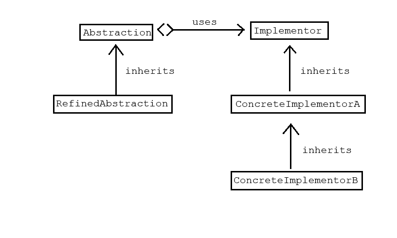

# 桥接模式

桥接模式是一种结构型设计模式，它的核心思想是将抽象部分与实现部分分离，使它们可以独立变化。桥接模式将抽象与实现解耦，使两者可以独立地变化。它通过组合而非继承来实现这种解耦。

核心组成部分如下：

1. 抽象（Abstraction）：定义抽象类的接口
2. 精确抽象（Refined Abstraction）：扩展抽象类的接口
3. 实现（Implementor）：定义实现类的接口
4. 具体实现（Concrete Implementor）：实现实现类接口的具体类

## 适用场景

1. 需要避免抽象和实现的永久绑定：例如，一个图形系统需要支持多种渲染引擎。
2. 抽象和实现都需要通过子类扩展：例如，不同形状（圆形、方形）和不同颜色（红色、蓝色）的组合。
3. 实现的变化不应该影响客户端：客户端代码只依赖于抽象接口。
4. 需要在运行时切换实现：例如，在不同平台上使用不同的API实现。
5. 有多个维度的变化：当系统有多个正交的变化维度时，使用桥接模式比使用继承更合适。

## 示例

```cpp
#include <iostream>
#include <string>
#include <memory>

// 实现部分的接口
class Implementor {
public:
    virtual ~Implementor() = default;
    virtual void operationImpl() const = 0;
};

// 具体实现A
class ConcreteImplementorA : public Implementor {
public:
    void operationImpl() const override {
        std::cout << "ConcreteImplementorA operation" << std::endl;
    }
};

// 具体实现B
class ConcreteImplementorB : public Implementor {
public:
    void operationImpl() const override {
        std::cout << "ConcreteImplementorB operation" << std::endl;
    }
};

// 抽象部分
class Abstraction {
protected:
    std::shared_ptr<Implementor> implementor;
    
public:
    Abstraction(std::shared_ptr<Implementor> impl) : implementor(impl) {}
    virtual ~Abstraction() = default;
    
    virtual void operation() const {
        std::cout << "Abstraction: ";
        implementor->operationImpl();
    }
};

// 精确抽象
class RefinedAbstraction : public Abstraction {
public:
    RefinedAbstraction(std::shared_ptr<Implementor> impl) : Abstraction(impl) {}
    
    void operation() const override {
        std::cout << "RefinedAbstraction: ";
        implementor->operationImpl();
    }
    
    // 扩展的方法
    void additionalOperation() const {
        std::cout << "Additional operation in RefinedAbstraction" << std::endl;
        implementor->operationImpl();
    }
};

int main() {
    // 创建实现
    auto implA = std::make_shared<ConcreteImplementorA>();
    auto implB = std::make_shared<ConcreteImplementorB>();
    
    // 创建抽象
    Abstraction abstraction(implA);
    abstraction.operation();
    
    // 创建精确抽象，使用不同的实现
    RefinedAbstraction refinedAbstraction(implB);
    refinedAbstraction.operation();
    refinedAbstraction.additionalOperation();
    
    // 动态切换实现
    refinedAbstraction = RefinedAbstraction(implA);
    refinedAbstraction.operation();
    
    return 0;
}
```



观察抽象部分，其使用组合的方法获得接口的声明，通过传入具体实现从而实现动态多态调用。抽象接口的使用允许组件之间在不了解具体实现的情况下彼此交互。